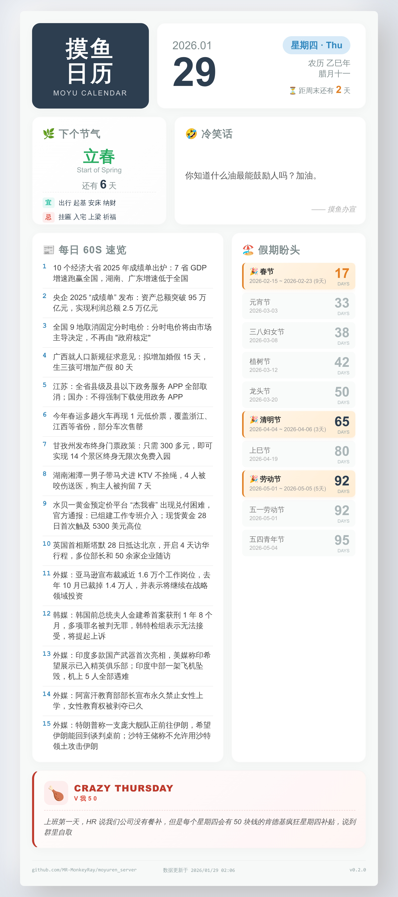

# Moyuren Server

摸鱼日历图片生成服务 | FastAPI + Playwright

## 预览



## 功能

- 每日定时生成摸鱼日历图片（支持多时间点）
- 按需生成：启动时或请求时若无可用图片则自动生成
- 节日倒计时整合（法定假日 + 农历/公历节日）
- 趣味内容随机展示（冷笑话、一言、段子、摸鱼语录）
- 疯狂星期四：每周四自动展示 KFC 文案
- Playwright 高质量浏览器渲染
- 自动清理过期缓存
- RESTful API + 静态文件服务
- YAML 配置 + 环境变量覆盖

## 快速开始

### 本地运行

```bash
# 安装依赖
pip install -r requirements.txt
playwright install chromium

# 启动服务
uvicorn app.main:app --reload
```

服务地址：http://127.0.0.1:8000

### Docker 运行

```bash
docker-compose up -d
```

如遇权限问题：

```bash
mkdir -p static state logs
sudo chown -R 1000:1000 static state logs
```

## API

| 方法 | 路径 | 说明 |
| ---- | ---- | ---- |
| GET | `/healthz` | 健康检查 |
| GET | `/api/v1/moyuren` | 获取最新图片元数据 |
| GET | `/static/{filename}` | 静态图片文件 |

> 注：当无可用图片时，`/api/v1/moyuren` 会自动触发按需生成，请求会等待生成完成后返回结果（最长等待 60 秒）。

### 响应示例

```json
{
  "date": "2026-01-28",
  "timestamp": "2026-01-28T06:00:00",
  "image": "http://127.0.0.1:8000/static/moyuren_20260128_060000.jpg"
}
```

## 配置

配置文件：`config.yaml`

### 主要配置项

| 配置项 | 环境变量 | 说明 |
| ------ | -------- | ---- |
| `server.port` | `SERVER_PORT` | 服务端口 |
| `server.base_domain` | `SERVER_BASE_DOMAIN` | 图片 URL 前缀 |
| `scheduler.daily_times` | `SCHEDULER_DAILY_TIMES` | 生成时间（逗号分隔） |
| `render.viewport_width` | `RENDER_VIEWPORT_WIDTH` | 视口宽度 |
| `render.viewport_height` | `RENDER_VIEWPORT_HEIGHT` | 视口最小高度 |
| `render.device_scale_factor` | `RENDER_DEVICE_SCALE_FACTOR` | 缩放因子 |
| `cache.ttl_hours` | `CACHE_TTL_HOURS` | 缓存保留时长 |
| `logging.level` | `LOG_LEVEL` | 日志级别 |
| `holiday.mirror_urls` | `HOLIDAY_MIRROR_URLS` | GitHub 代理镜像站（逗号分隔） |
| `holiday.timeout_sec` | `HOLIDAY_TIMEOUT_SEC` | 节假日数据请求超时 |
| `fun_content.timeout_sec` | - | 趣味内容 API 超时 |
| `fun_content.endpoints` | - | 趣味内容 API 端点列表（仅 YAML） |
| `crazy_thursday.enabled` | - | 是否启用疯狂星期四功能 |
| `crazy_thursday.url` | - | KFC 文案 API 地址 |
| `crazy_thursday.timeout_sec` | - | KFC API 超时时间 |

### 配置示例

```yaml
server:
  port: 8000
  base_domain: "https://example.com"

scheduler:
  daily_times:
    - "06:00"
    - "18:00"

render:
  viewport_width: 794
  viewport_height: 1123
  device_scale_factor: 3
  jpeg_quality: 100

holiday:
  # GitHub 代理镜像站前缀列表
  # 程序自动拼接为：https://ghfast.top/raw.githubusercontent.com/NateScarlet/holiday-cn/master/{year}.json
  # 留空则直接使用 GitHub 原始源
  mirror_urls:
    - "https://ghfast.top/"
  timeout_sec: 10

fun_content:
  timeout_sec: 5
  endpoints:
    - name: "dad_joke"
      url: "https://60s.viki.moe/v2/dad-joke"
      data_path: "data.content"
      display_title: "🤣 冷笑话"
    - name: "hitokoto"
      url: "https://60s.viki.moe/v2/hitokoto"
      data_path: "data.hitokoto"
      display_title: "💬 一言"
```

## 目录结构

```text
moyuren_server/
├── app/
│   ├── main.py           # 应用入口
│   ├── api/v1/           # API 路由
│   ├── core/             # 配置、调度、错误处理
│   ├── services/         # 业务逻辑
│   │   ├── fetcher.py    # 数据获取
│   │   ├── holiday.py    # 节假日服务
│   │   ├── fun_content.py # 趣味内容服务
│   │   ├── kfc.py        # 疯狂星期四服务
│   │   ├── calendar.py   # 日历计算
│   │   ├── compute.py    # 数据计算
│   │   ├── renderer.py   # 图片渲染
│   │   ├── generator.py  # 图片生成流水线
│   │   └── cache.py      # 缓存清理
│   └── models/           # 数据模型
├── templates/            # Jinja2 模板
├── scripts/              # 工具脚本
├── config.yaml           # 配置文件
└── docker-compose.yaml   # Docker 编排
```

## 许可证

AGPL-3.0
