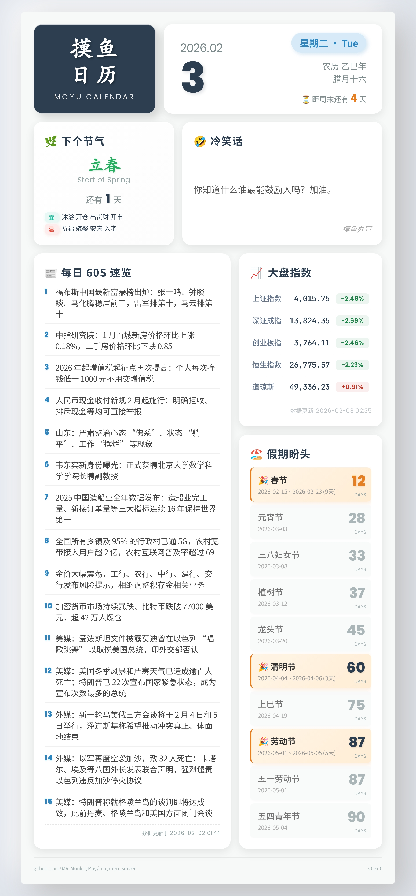

# Moyuren Server

摸鱼日历图片生成服务 | FastAPI + Playwright

## 预览



## api体验

```bash
https://api.monkeyray.net/api/v1/moyuren
```

## 功能

- 定时生成摸鱼日历图片（支持 daily/hourly 模式）
- 按需生成：启动时或请求时若无可用图片则自动生成
- 智能缓存管理：
  - 日级缓存：数据源独立缓存，次日自动过期
  - 启动预热：应用启动时并行预热所有缓存
  - 混合更新策略：缓存过期时后台异步刷新（快速启动），无缓存时同步生成
  - 降级策略：网络失败时返回过期缓存
  - 自动清理过期图片文件
- 60 秒读懂世界新闻
  - 数据源：[60s-api](https://60s.viki.moe)
- 农历信息与节气（干支年、生肖、二十四节气）
  - 数据源：[tyme4py](https://github.com/6tail/tyme4py)
- 节日倒计时整合（法定假日 + 农历/公历节日）
  - 数据源：[holiday-cn](https://github.com/NateScarlet/holiday-cn)
- 趣味内容随机展示（冷笑话、一言、段子、摸鱼语录）
  - 数据源：[60s-api](https://60s.viki.moe)
- 疯狂星期四：每周四自动展示 KFC 文案
  - 数据源：[60s-api](https://60s.viki.moe)
- 大盘指数实时行情（上证、深证、创业板、恒生、道琼斯）
  - 数据源：[东方财富](https://www.eastmoney.com)
  - 交易日历：[exchange_calendars](https://github.com/gerrymanoim/exchange_calendars)
- Playwright 高质量浏览器渲染
- 自动清理过期缓存
- RESTful API + 静态文件服务
- YAML 配置 + 环境变量覆盖

## 快速开始

### 本地运行

```bash
# 安装依赖
pip install -r requirements.txt
playwright install chromium

# 启动服务
uvicorn app.main:app --reload
```

服务地址：http://127.0.0.1:8000

### Docker 运行

```bash
docker-compose up -d
```

如遇权限问题：

```bash
mkdir -p static state logs
sudo chown -R 1000:1000 static state logs
```

## API

| 方法 | 路径 | 说明 |
| ---- | ---- | ---- |
| GET | `/healthz` | 健康检查 |
| GET | `/api/v1/moyuren` | 获取图片元信息（精简版） |
| GET | `/api/v1/moyuren/detail` | 获取图片内容详情 |
| GET | `/api/v1/moyuren/latest` | 直接获取最新图片文件（JPEG） |
| GET | `/static/{filename}` | 静态图片文件 |

> 注：当无可用图片时，API 会自动触发按需生成；若生成任务已在进行中，将返回 `503` 并附带 `Retry-After: 5` 响应头，建议稍后重试。

### 端点详情

<details>
<summary>GET /healthz - 健康检查</summary>

返回服务健康状态，支持 GET 和 HEAD 方法。

**响应示例**：

```json
{
  "status": "ok"
}
```

</details>

<details>
<summary>GET /api/v1/moyuren - 图片元信息（精简版）</summary>

获取最新生成图片的基本元数据，包含日期、生成时间和图片 URL。

**响应示例**：

```json
{
  "date": "2026-02-06",
  "updated": "2026/02/06 18:53:17",
  "updated_at": 1770375197567,
  "image": "https://api.monkeyray.net/static/moyuren_20260206_185317.jpg"
}
```

**字段说明**：

| 字段 | 类型 | 说明 |
| ---- | ---- | ---- |
| `date` | string | 图片日期 (YYYY-MM-DD) |
| `updated` | string | 生成时间 (如 2026/02/01 07:22:32) |
| `updated_at` | number | 生成时间戳（13 位毫秒） |
| `image` | string | 图片完整 URL |

</details>

<details>
<summary>GET /api/v1/moyuren/latest - 直接获取图片文件</summary>

直接返回最新生成的 JPEG 图片文件，适用于：

- 在 HTML 中使用 `` 标签直接嵌入
- 在 Markdown 中使用 `` 显示
- 需要直接下载图片的场景

**响应类型**：`image/jpeg`

</details>

<details>
<summary>GET /api/v1/moyuren/detail - 内容详情（完整版）</summary>

获取图片的完整内容数据，包含日期信息、节假日、节气、趣味内容、大盘指数等所有渲染数据。

**响应示例**：

```jsonc
{
  "date": "2026-02-06",
  "updated": "2026/02/06 18:53:17",
  "updated_at": 1770375197567,
  "image": "https://api.monkeyray.net/static/moyuren_20260206_185317.jpg",
  "weekday": "星期五",
  "lunar_date": "腊月十九",
  "fun_content": {
    "type": "dad_joke",
    "title": "🤣 冷笑话",
    "text": "为什么喝醉以后觉得别人都变矮了？因为喝高了。"
  },
  "is_crazy_thursday": false,
  "kfc_content": null,
  "date_info": {
    "year_month": "2026.02",
    "day": "6",
    "week_cn": "星期五",
    "week_en": "Fri",
    "lunar_year": "乙巳年",
    "lunar_date": "腊月十九",
    "zodiac": "蛇",
    "constellation": "水瓶座",
    "moon_phase": "残月",
    "festival_solar": null,
    "festival_lunar": null,
    "legal_holiday": null,
    "is_holiday": false
  },
  "weekend": {
    "days_left": 1,
    "is_weekend": false
  },
  "solar_term": {
    "name": "雨水",
    "name_en": "Rain Water",
    "days_left": 12,
    "date": "2026-02-18",
    "is_today": false
  },
  "guide": {
    "yi": [
      "移徙",
      "祭祀",
      "开光",
      "祈福"
    ],
    "ji": [
      "嫁娶",
      "安葬",
      "破土",
      "作梁"
    ]
  },
  "news_list": [
    "我国网民规模达 11.25 亿人，互联网普及率突破 80%，生成式人工智能用户规模达 6.02 亿人",
    "腾讯游戏发布 2026 年寒假限玩日历：未成年玩家最多可玩 15 小时"
    // ... 更多新闻
  ],
  "news_meta": {
    "date": "2026-02-06",
    "updated": "2026-02-06T01:29:00+08:00",
    "updated_at": 1770312596000
  },
  "holidays": [
    {
      "name": "春节",
      "start_date": "2026-02-15",
      "end_date": "2026-02-23",
      "duration": 9,
      "days_left": 9,
      "is_legal_holiday": true,
      "is_off_day": true
    },
    {
      "name": "清明节",
      "start_date": "2026-04-04",
      "end_date": "2026-04-06",
      "duration": 3,
      "days_left": 57,
      "is_legal_holiday": true,
      "is_off_day": true
    }
    // ... 更多节假日
  ],
  "kfc_content_full": null,
  "stock_indices": {
    "items": [
      {
        "code": "000001",
        "name": "上证指数",
        "price": 4065.58,
        "change": -10.34,
        "change_pct": -0.25,
        "trend": "down",
        "market": "A",
        "is_trading_day": true
      },
      {
        "code": "HSI",
        "name": "恒生指数",
        "price": 26559.95,
        "change": -325.29,
        "change_pct": -1.21,
        "trend": "down",
        "market": "HK",
        "is_trading_day": true
      }
      // ... 更多指数
    ],
    "updated": "2026/02/06 18:53:14",
    "updated_at": 1770375194513,
    "trading_day": {
      "A": true,
      "HK": true,
      "US": true
    },
    "is_stale": false
  }
}
```

**字段说明**：

| 字段 | 类型 | 说明 |
| ---- | ---- | ---- |
| `date` | string | 图片日期 (YYYY-MM-DD) |
| `updated` | string | 生成时间 (如 2026/02/01 07:22:32) |
| `updated_at` | number | 生成时间戳（13 位毫秒） |
| `image` | string | 图片完整 URL |
| `weekday` | string | 星期几（中文） |
| `lunar_date` | string | 农历日期 |
| `fun_content` | object | 趣味内容（type: dad_joke/hitokoto/duanzi/moyu_quote） |
| `is_crazy_thursday` | boolean | 是否为周四 |
| `kfc_content` | string \| null | KFC 文案内容（仅周四有值） |
| `date_info` | object | 完整日期信息（年月、农历、生肖、星座、月相、节日） |
| `weekend` | object | 周末倒计时（days_left, is_weekend） |
| `solar_term` | object | 节气信息（名称、天数、日期） |
| `guide` | object | 宜忌指南（yi, ji 列表） |
| `news_list` | array | 新闻文本列表 |
| `news_meta` | object | 新闻元数据（date, updated, updated_at） |
| `holidays` | array | 详细节假日列表（含法定假日标识、时长） |
| `kfc_content_full` | object \| null | 完整 KFC 对象（title, sub_title, content） |
| `stock_indices` | object | 大盘指数数据（items: 指数列表, trading_day: 交易日状态, is_stale: 数据是否过期） |

</details>

<details>
<summary>错误响应格式</summary>

所有 API 端点在发生错误时返回统一的错误响应格式。

**响应示例**：

```json
{
  "error": {
    "code": "STORAGE_4003",
    "message": "No image available",
    "detail": "State file not found"
  }
}
```

**常见错误码**：

| HTTP 状态码 | 错误码 | 说明 |
| ----------- | ------ | ---- |
| 404 | `STORAGE_4003` | 无可用图片（state 文件不存在） |
| 500 | `GENERATION_5001` | 图片生成失败 |
| 503 | `GENERATION_5002` | 图片生成中（响应头包含 `Retry-After: 5`） |

</details>

## 配置

配置文件：`config.yaml`

### 主要配置项

| 配置项 | 环境变量 | 说明 |
| ------ | -------- | ---- |
| `server.host` | `SERVER_HOST` | 监听地址 |
| `server.port` | `SERVER_PORT` | 服务端口 |
| `server.base_domain` | `SERVER_BASE_DOMAIN` | 图片 URL 前缀 |
| `paths.static_dir` | `PATHS_STATIC_DIR` | 图片输出目录 |
| `paths.state_path` | `PATHS_STATE_PATH` | 最新图片状态文件路径 |
| `paths.template_path` | - | 默认模板路径（单模板模式兼容字段） |
| `scheduler.mode` | `SCHEDULER_MODE` | 调度模式（`daily` 或 `hourly`） |
| `scheduler.daily_times` | `SCHEDULER_DAILY_TIMES` | 生成时间（逗号分隔） |
| `scheduler.minute_of_hour` | `SCHEDULER_MINUTE_OF_HOUR` | 每小时模式下的触发分钟（0-59） |
| `render.viewport_width` | `RENDER_VIEWPORT_WIDTH` | 视口宽度 |
| `render.viewport_height` | `RENDER_VIEWPORT_HEIGHT` | 视口最小高度 |
| `render.device_scale_factor` | `RENDER_DEVICE_SCALE_FACTOR` | 缩放因子 |
| `render.jpeg_quality` | `RENDER_JPEG_QUALITY` | JPEG 质量（1-100） |
| `render.use_china_cdn` | `RENDER_USE_CHINA_CDN` | 字体 CDN 开关（true: 大陆 CDN fonts.googleapis.cn, false: 国际 CDN fonts.googleapis.com） |
| `cache.ttl_hours` | `CACHE_TTL_HOURS` | 缓存保留时长 |
| `logging.level` | `LOG_LEVEL` | 日志级别 |
| `logging.file` | `LOG_FILE` | 日志文件路径（空字符串表示只输出到标准输出） |
| `timezone.business` | - | 业务时区（节假日/节气/周末判断） |
| `timezone.display` | - | 显示时区（图片时间戳、API 响应时间；支持 `local`） |
| `fetch.api_endpoints` | - | 外部数据源端点配置（如新闻） |
| `holiday.mirror_urls` | `HOLIDAY_MIRROR_URLS` | GitHub 代理镜像站（逗号分隔） |
| `holiday.timeout_sec` | `HOLIDAY_TIMEOUT_SEC` | 节假日数据请求超时 |
| `fun_content.timeout_sec` | - | 趣味内容 API 超时 |
| `fun_content.endpoints` | - | 趣味内容 API 端点列表（仅 YAML） |
| `crazy_thursday.enabled` | - | 是否启用疯狂星期四功能 |
| `crazy_thursday.url` | - | KFC 文案 API 地址 |
| `crazy_thursday.timeout_sec` | - | KFC API 超时时间 |
| `templates.default` | - | 默认模板名（多模板模式） |
| `templates.items` | - | 模板列表（多模板模式，支持 viewport/theme/jpeg_quality 覆盖） |
| `stock_index.quote_url` | - | 大盘指数行情接口地址 |
| `stock_index.secids` | - | 指数列表（东方财富 secid） |
| `stock_index.timeout_sec` | - | 行情请求超时（秒） |
| `stock_index.market_timezones` | - | 各市场时区配置（A/HK/US） |
| `stock_index.cache_ttl_sec` | - | 行情缓存 TTL（秒） |

### 调度配置说明

- `scheduler.mode` 支持 `daily` 与 `hourly`
- 当 `mode=hourly` 时，任务会在每小时的 `scheduler.minute_of_hour` 分触发
- 当 `mode=daily` 时，任务会按 `scheduler.daily_times` 中每个 `HH:MM` 时间触发
- `mode=hourly` 时 `daily_times` 会被忽略，建议保留以便快速回退到 `daily`
- 环境变量覆盖：`SCHEDULER_MODE`、`SCHEDULER_DAILY_TIMES`、`SCHEDULER_MINUTE_OF_HOUR`

### 缓存目录结构

```
state/
├── holidays/          # 节假日原始年度数据缓存
│   ├── 2025.json
│   ├── 2026.json
│   └── 2027.json
├── cache/             # 日级缓存目录
│   ├── news.json      # 新闻数据
│   ├── fun_content.json  # 趣味内容
│   ├── kfc.json       # KFC 文案（仅周四有效）
│   └── holidays.json  # 聚合后的节假日列表
├── latest.json        # 最新图片状态
└── .generation.lock   # 生成锁文件
```

日级缓存文件格式：
```json
{
  "date": "2026-02-05",
  "data": { ... },
  "fetched_at": 1738713600000
}
```

### 配置示例

```yaml
server:
  host: "0.0.0.0"
  port: 8000
  base_domain: "https://example.com"

timezone:
  business: "Asia/Shanghai"
  display: "local"

paths:
  static_dir: "static"
  template_path: "templates/moyuren.html"
  state_path: "state/latest.json"

scheduler:
  mode: "daily"
  daily_times:
    - "06:00"
    - "18:00"
  minute_of_hour: 0

# 每小时模式示例（每小时第 0 分执行）
# scheduler:
#   mode: "hourly"
#   daily_times:
#     - "06:00"   # hourly 模式下会被忽略，仅用于回退 daily 时复用
#   minute_of_hour: 0

fetch:
  api_endpoints:
    - name: "news"
      url: "https://60s.viki.moe/v2/60s"
      timeout_sec: 10
      params:
        "force-update": "false"

render:
  viewport_width: 794
  viewport_height: 1123
  device_scale_factor: 3
  jpeg_quality: 100
  # 字体 CDN 配置
  # true: 使用大陆 CDN (fonts.googleapis.cn)
  # false: 使用国际 CDN (fonts.googleapis.com)
  use_china_cdn: false

holiday:
  # GitHub 代理镜像站前缀列表
  # 程序自动拼接为：https://ghfast.top/raw.githubusercontent.com/NateScarlet/holiday-cn/master/{year}.json
  # 留空则直接使用 GitHub 原始源
  mirror_urls:
    - "https://ghfast.top/"
  timeout_sec: 10

fun_content:
  timeout_sec: 5
  endpoints:
    - name: "dad_joke"
      url: "https://60s.viki.moe/v2/dad-joke"
      data_path: "data.content"
      display_title: "🤣 冷笑话"
    - name: "hitokoto"
      url: "https://60s.viki.moe/v2/hitokoto"
      data_path: "data.hitokoto"
      display_title: "💬 一言"

logging:
  level: "INFO"
  file: "logs/app.log"
```

## 目录结构

```text
moyuren_server/
├── app/
│   ├── main.py           # 应用入口
│   ├── api/v1/           # API 路由
│   ├── core/             # 配置、调度、错误处理
│   ├── services/         # 业务逻辑
│   │   ├── daily_cache.py # 日级缓存抽象基类
│   │   ├── fetcher.py    # 数据获取
│   │   ├── holiday.py    # 节假日服务
│   │   ├── fun_content.py # 趣味内容服务
│   │   ├── kfc.py        # 疯狂星期四服务
│   │   ├── calendar.py   # 日历计算
│   │   ├── compute.py    # 数据计算
│   │   ├── stock_index.py # 大盘指数服务
│   │   ├── browser.py    # Playwright 浏览器管理
│   │   ├── state.py      # 状态文件读写
│   │   ├── renderer.py   # 图片渲染
│   │   ├── generator.py  # 图片生成流水线
│   │   └── cache.py      # 缓存清理
│   └── models/           # 数据模型
├── templates/            # Jinja2 模板
├── scripts/              # 工具脚本
├── example/              # 示例文件
│   ├── moyuren_example.jpg        # 示例图片
│   ├── detail_normal.json         # 普通工作日响应示例
│   ├── detail_weekend.json        # 周末响应示例
│   ├── detail_crazy_thursday.json # 疯狂星期四响应示例
│   ├── detail_holiday.json        # 节假日响应示例
│   └── detail_solar_term.json     # 节气当天响应示例
├── static/               # 图片输出目录（可配置）
├── state/                # 状态文件目录（latest.json）
├── logs/                 # 日志目录
├── tests/                # 测试
├── config.yaml           # 配置文件
└── docker-compose.yaml   # Docker 编排
```

## 许可证

AGPL-3.0
