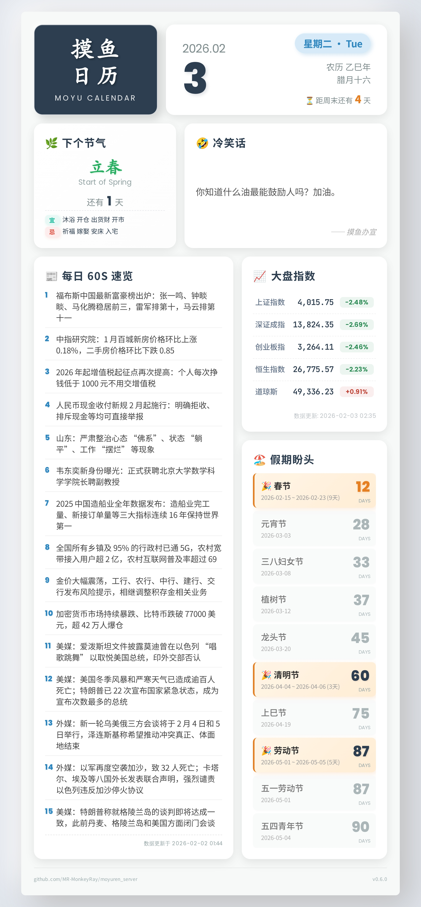

# Moyuren Server

摸鱼日历图片生成服务 | FastAPI + Playwright

## 预览



## api体验

```bash
https://api.monkeyray.net/api/v1/moyuren
```

## 功能

- 定时生成摸鱼日历图片（支持 daily/hourly 模式）
- 按需生成：启动时或请求时若无可用图片则自动生成
- 智能缓存管理：
  - 日级缓存：数据源独立缓存，次日自动过期
  - 启动预热：应用启动时并行预热所有缓存
  - 混合更新策略：缓存过期时后台异步刷新（快速启动），无缓存时同步生成
  - 降级策略：网络失败时返回过期缓存
  - 自动清理过期图片文件
- 60 秒读懂世界新闻
  - 数据源：[60s-api](https://60s.viki.moe)
- 农历信息与节气（干支年、生肖、二十四节气）
  - 数据源：[tyme4py](https://github.com/6tail/tyme4py)
- 节日倒计时整合（法定假日 + 农历/公历节日）
  - 数据源：[holiday-cn](https://github.com/NateScarlet/holiday-cn)
- 趣味内容随机展示（冷笑话、一言、段子、摸鱼语录）
  - 数据源：[60s-api](https://60s.viki.moe)
- 疯狂星期四：每周四自动展示 KFC 文案
  - 数据源：[60s-api](https://60s.viki.moe)
- 大盘指数实时行情（上证、深证、创业板、恒生、道琼斯）
  - 数据源：[东方财富](https://www.eastmoney.com)
  - 交易日历：[exchange_calendars](https://github.com/gerrymanoim/exchange_calendars)
- Playwright 高质量浏览器渲染
- 自动清理过期缓存
- RESTful API + 静态文件服务
- 静态发布到 Cloudflare Pages（GitHub Actions 定时推送）
- YAML 配置 + 环境变量覆盖

## 快速开始

### 本地运行

```bash
# 安装依赖
pip install -r requirements.txt
playwright install chromium

# 启动服务
uvicorn app.main:app --reload
```

服务地址：http://127.0.0.1:8000

### Docker 运行

```bash
docker-compose up -d
```

如遇权限问题：

```bash
mkdir -p cache logs
sudo chown -R 1000:1000 cache logs
```

## API

| 方法 | 路径 | 说明 |
| ---- | ---- | ---- |
| GET | `/healthz` | 健康检查 |
| GET | `/readyz` | 就绪检查 |
| GET | `/api/v1/moyuren` | 统一端点：图片元信息/详情/文本/Markdown/图片 |
| GET | `/api/v1/templates` | 获取支持的模板列表 |
| GET | `/api/v1/ops/generate` | 手动触发图片生成（需鉴权） |
| GET | `/api/v1/ops/cache/clean` | 清理过期缓存（需鉴权） |
| GET | `/static/{filename}` | 静态图片文件 |

> 注：当无可用图片时，API 会自动触发按需生成；若生成任务已在进行中，将返回 `503` 并附带 `Retry-After: 5` 响应头。Ops 端点需要 `Authorization: Bearer <api_key>` 鉴权。

### 静态发布

通过 GitHub Actions 每 30 分钟自动生成摸鱼日历图片及结构化数据，推送到独立仓库 [moyuren-pages](https://github.com/monkeyray/moyuren-pages)，由 Cloudflare Pages 托管。

**静态站点地址**：https://moyuren.pages.dev

**可用格式**：

| 路径 | 说明 |
| ---- | ---- |
| `/latest.json` | 最新数据（JSON） |
| `/latest.jpg` | 最新图片 |
| `/latest.txt` | 最新纯文本 |
| `/latest.md` | 最新 Markdown |
| `/history.json` | 可用日期列表 |
| `/{date}/data.json` | 指定日期数据 |
| `/{date}/moyuren.jpg` | 指定日期图片 |
| `/{date}/data.txt` | 指定日期纯文本 |
| `/{date}/data.md` | 指定日期 Markdown |

**相关文件**：
- `scripts/publish_static.py` — 静态产物生成脚本
- `.github/workflows/publish-static.yml` — 定时发布 workflow

### 端点详情

<details>
<summary>GET /healthz - 健康检查</summary>

返回服务健康状态，支持 GET 和 HEAD 方法。

**响应示例**：

```json
{
  "status": "ok"
}
```

</details>

<details>
<summary>GET /readyz - 就绪检查</summary>

验证服务是否可以处理请求，支持 GET 和 HEAD 方法。

**响应示例**：

```json
{
  "status": "ready",
  "checks": {
    "config": true,
    "cache_dir": true
  }
}
```

</details>

<details>
<summary>GET /api/v1/moyuren - 统一端点</summary>

获取摸鱼日历数据，支持多种输出格式和查询参数。

**查询参数**：

| 参数 | 类型 | 默认值 | 说明 |
| ---- | ---- | ------ | ---- |
| `date` | string | 今天 | 目标日期 (YYYY-MM-DD) |
| `encode` | string | `json` | 输出格式：`json`、`text`、`markdown`、`image` |
| `template` | string | 首个可用 | 模板名称 |
| `detail` | boolean | `false` | 是否返回详细字段（仅 encode=json） |

**输出格式**：

- `encode=json`：JSON 元数据（精简或详细）
- `encode=text`：纯文本格式
- `encode=markdown`：Markdown 格式
- `encode=image`：直接返回 JPEG 图片文件

**HTTP 缓存**：

- 历史日期（< 今天）：`Cache-Control: public, max-age=31536000, immutable`
- 当天数据：`ETag` + `Last-Modified`，支持 `304 Not Modified`

**精简响应示例**（`encode=json`）：

```json
{
  "date": "2026-02-06",
  "updated": "2026/02/06 18:53:17",
  "updated_at": 1770375197567,
  "image": "https://api.monkeyray.net/static/moyuren_20260206_185317.jpg"
}
```

**详细响应**（`encode=json&detail=true`）包含精简响应的所有字段，以及：weekday、lunar_date、fun_content、is_crazy_thursday、kfc_content、date_info、weekend、solar_term、guide、news_list、news_meta、holidays、kfc_content_full、stock_indices。

详细字段说明参见 [Pydantic 模型](app/models/schemas.py) 中的 `MoyurenDetailResponse`。

</details>

<details>
<summary>GET /api/v1/templates - 模板列表</summary>

获取支持的模板列表及当前图片 URL。

**响应示例**：

```json
{
  "data": [
    {
      "name": "moyuren",
      "description": "摸鱼日历moyuren模板",
      "image": "https://api.monkeyray.net/static/moyuren_20260210_072232.jpg"
    }
  ]
}
```

**缓存**：`Cache-Control: public, max-age=3600`

</details>

<details>
<summary>GET /api/v1/ops/* - 运维端点（需鉴权）</summary>

所有 Ops 端点需要 `Authorization: Bearer <api_key>` 请求头。

**GET /api/v1/ops/generate** - 手动触发图片生成

**GET /api/v1/ops/cache/clean** - 清理过期缓存
- 可选参数：`keep_days`（保留最近 N 天）

**鉴权失败响应**（401）：

```json
{
  "error": {
    "code": "AUTH_6001",
    "message": "无效的 API Key"
  }
}
```

</details>

<details>
<summary>错误响应格式</summary>

所有 API 端点在发生错误时返回统一的错误响应格式。

**响应示例**：

```json
{
  "error": {
    "code": "STORAGE_4003",
    "message": "No image available"
  }
}
```

**常见错误码**：

| HTTP 状态码 | 错误码 | 说明 |
| ----------- | ------ | ---- |
| 400 | `API_7001` | 无效的日期格式 |
| 400 | `API_7002` | 无效的 encode 参数 |
| 400 | `API_7003` | 无效的请求参数 |
| 401 | `AUTH_6001` | 未授权（API Key 无效） |
| 404 | `API_7004` | 数据不存在 |
| 404 | `API_7005` | 模板不存在 |
| 404 | `STORAGE_4003` | 无可用图片 |
| 500 | `GENERATION_5001` | 图片生成失败 |
| 503 | `GENERATION_5002` | 图片生成中（Retry-After: 5） |

</details>

## 配置

配置文件：`config.yaml`

### 主要配置项

| 配置项 | 环境变量 | 说明 |
| ------ | -------- | ---- |
| `server.host` | `SERVER_HOST` | 监听地址 |
| `server.port` | `SERVER_PORT` | 服务端口 |
| `server.base_domain` | `SERVER_BASE_DOMAIN` | 图片 URL 前缀 |
| `paths.cache_dir` | `PATHS_CACHE_DIR` | 缓存根目录（默认 `cache`） |
| `scheduler.mode` | `SCHEDULER_MODE` | 调度模式（`daily` 或 `hourly`） |
| `scheduler.daily_times` | `SCHEDULER_DAILY_TIMES` | 生成时间（逗号分隔） |
| `scheduler.minute_of_hour` | `SCHEDULER_MINUTE_OF_HOUR` | 每小时模式下的触发分钟（0-59） |
| `render.viewport_width` | `RENDER_VIEWPORT_WIDTH` | 视口宽度 |
| `render.viewport_height` | `RENDER_VIEWPORT_HEIGHT` | 视口最小高度 |
| `render.device_scale_factor` | `RENDER_DEVICE_SCALE_FACTOR` | 缩放因子 |
| `render.jpeg_quality` | `RENDER_JPEG_QUALITY` | JPEG 质量（1-100） |
| `render.use_china_cdn` | `RENDER_USE_CHINA_CDN` | 字体 CDN 开关（true: 大陆 CDN fonts.googleapis.cn, false: 国际 CDN fonts.googleapis.com） |
| `cache.retain_days` | `CACHE_RETAIN_DAYS` | 缓存保留天数（默认 30） |
| `ops.api_key` | `OPS_API_KEY` | 运维 API Key（留空则禁用 ops 端点） |
| `logging.level` | `LOG_LEVEL` | 日志级别 |
| `logging.file` | `LOG_FILE` | 日志文件路径（空字符串表示只输出到标准输出） |
| `timezone.business` | - | 业务时区（节假日/节气/周末判断） |
| `timezone.display` | - | 显示时区（图片时间戳、API 响应时间；支持 `local`） |
| `fetch.api_endpoints` | - | 外部数据源端点配置（如新闻） |
| `holiday.mirror_urls` | `HOLIDAY_MIRROR_URLS` | GitHub 代理镜像站（逗号分隔） |
| `holiday.timeout_sec` | `HOLIDAY_TIMEOUT_SEC` | 节假日数据请求超时 |
| `fun_content.timeout_sec` | - | 趣味内容 API 超时 |
| `fun_content.endpoints` | - | 趣味内容 API 端点列表（仅 YAML） |
| `crazy_thursday.enabled` | - | 是否启用疯狂星期四功能 |
| `crazy_thursday.url` | - | KFC 文案 API 地址 |
| `crazy_thursday.timeout_sec` | - | KFC API 超时时间 |
| `templates.default` | - | 默认模板名（多模板模式） |
| `templates.items` | - | 模板列表（多模板模式，支持 viewport/theme/jpeg_quality 覆盖） |
| `stock_index.quote_url` | - | 大盘指数行情接口地址 |
| `stock_index.secids` | - | 指数列表（东方财富 secid） |
| `stock_index.timeout_sec` | - | 行情请求超时（秒） |
| `stock_index.market_timezones` | - | 各市场时区配置（A/HK/US） |
| `stock_index.cache_ttl_sec` | - | 行情缓存 TTL（秒） |

### 调度配置说明

- `scheduler.mode` 支持 `daily` 与 `hourly`
- 当 `mode=hourly` 时，任务会在每小时的 `scheduler.minute_of_hour` 分触发
- 当 `mode=daily` 时，任务会按 `scheduler.daily_times` 中每个 `HH:MM` 时间触发
- `mode=hourly` 时 `daily_times` 会被忽略，建议保留以便快速回退到 `daily`
- 环境变量覆盖：`SCHEDULER_MODE`、`SCHEDULER_DAILY_TIMES`、`SCHEDULER_MINUTE_OF_HOUR`

### 缓存目录结构

```
cache/
├── data/              # 日期数据文件
│   ├── 2026-02-09.json
│   └── 2026-02-10.json
├── images/            # 生成的图片文件
│   ├── moyuren_20260209_072232.jpg
│   └── moyuren_20260210_183000.jpg
├── daily/             # 日级缓存（数据源）
│   ├── news.json
│   ├── fun_content.json
│   ├── kfc.json
│   └── holidays.json
├── holidays/          # 节假日原始年度数据
│   ├── 2025.json
│   └── 2026.json
└── .generation.lock   # 生成锁文件
```

### 配置示例

```yaml
server:
  host: "0.0.0.0"
  port: 8000
  base_domain: "https://example.com"

timezone:
  business: "Asia/Shanghai"
  display: "local"

paths:
  cache_dir: "cache"

scheduler:
  mode: "daily"
  daily_times:
    - "06:00"
    - "18:00"
  minute_of_hour: 0

# 每小时模式示例（每小时第 0 分执行）
# scheduler:
#   mode: "hourly"
#   daily_times:
#     - "06:00"   # hourly 模式下会被忽略，仅用于回退 daily 时复用
#   minute_of_hour: 0

fetch:
  api_endpoints:
    - name: "news"
      url: "https://60s.viki.moe/v2/60s"
      timeout_sec: 10
      params:
        "force-update": "false"

render:
  viewport_width: 794
  viewport_height: 1123
  device_scale_factor: 3
  jpeg_quality: 100
  # 字体 CDN 配置
  # true: 使用大陆 CDN (fonts.googleapis.cn)
  # false: 使用国际 CDN (fonts.googleapis.com)
  use_china_cdn: false

holiday:
  # GitHub 代理镜像站
  # 留空则直接使用 GitHub 原始源
  mirror_urls:
    - "https://ghfast.top/"
  timeout_sec: 10

fun_content:
  timeout_sec: 5
  endpoints:
    - name: "dad_joke"
      url: "https://60s.viki.moe/v2/dad-joke"
      data_path: "data.content"
      display_title: "🤣 冷笑话"
    - name: "hitokoto"
      url: "https://60s.viki.moe/v2/hitokoto"
      data_path: "data.hitokoto"
      display_title: "💬 一言"

cache:
  retain_days: 30

ops:
  api_key: ""  # 运维 API Key（留空则禁用 ops 端点）

logging:
  level: "INFO"
  file: "logs/app.log"
```

## 目录结构

```text
moyuren_server/
├── .github/workflows/   # CI/CD 工作流
├── app/
│   ├── main.py           # 应用入口
│   ├── api/v1/           # API 路由
│   ├── core/             # 配置、调度、错误处理
│   ├── services/         # 业务逻辑
│   │   ├── daily_cache.py # 日级缓存抽象基类
│   │   ├── fetcher.py    # 数据获取
│   │   ├── holiday.py    # 节假日服务
│   │   ├── fun_content.py # 趣味内容服务
│   │   ├── kfc.py        # 疯狂星期四服务
│   │   ├── calendar.py   # 日历计算
│   │   ├── compute.py    # 数据计算
│   │   ├── stock_index.py # 大盘指数服务
│   │   ├── browser.py    # Playwright 浏览器管理
│   │   ├── state.py      # 状态文件读写
│   │   ├── renderer.py   # 图片渲染
│   │   ├── generator.py  # 图片生成流水线
│   │   └── cache.py      # 缓存清理
│   └── models/           # 数据模型
├── templates/            # Jinja2 模板
├── scripts/              # 工具脚本
├── example/              # 示例文件
│   ├── moyuren_example.jpg        # 示例图片
│   ├── detail_normal.json         # 普通工作日响应示例
│   ├── detail_weekend.json        # 周末响应示例
│   ├── detail_crazy_thursday.json # 疯狂星期四响应示例
│   ├── detail_holiday.json        # 节假日响应示例
│   └── detail_solar_term.json     # 节气当天响应示例
├── cache/                # 缓存目录（数据/图片/日级缓存）
├── logs/                 # 日志目录
├── tests/                # 测试
├── config.yaml           # 配置文件
└── docker-compose.yaml   # Docker 编排
```

## 许可证

AGPL-3.0
